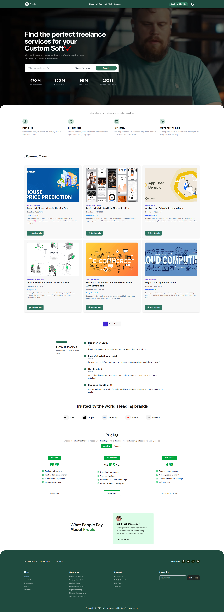
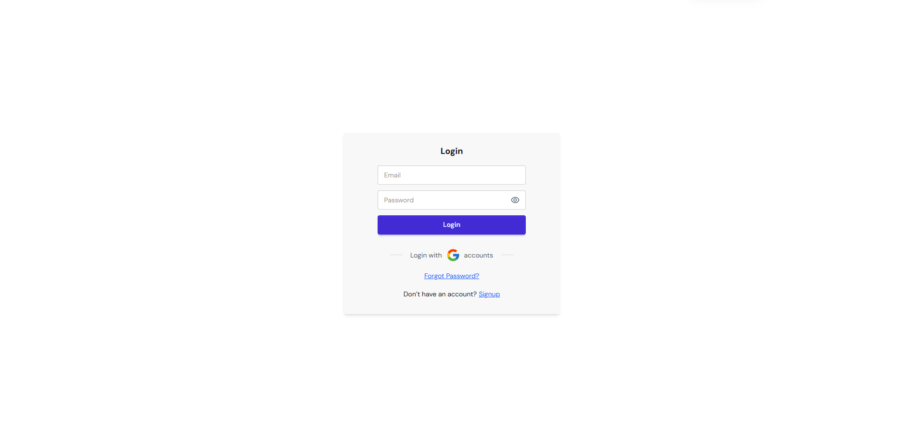
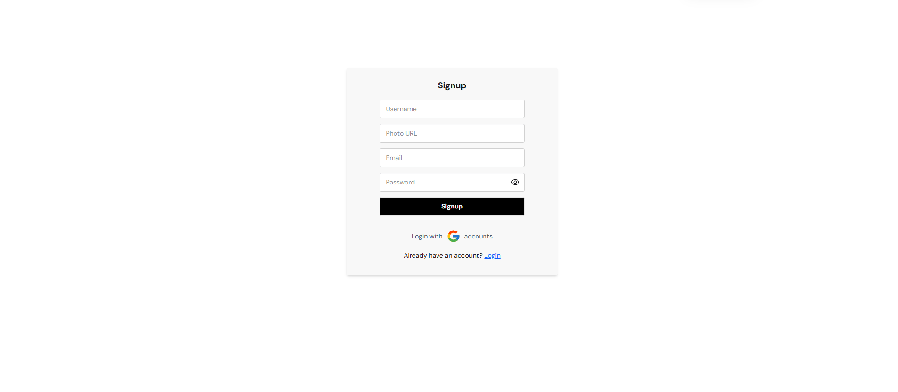
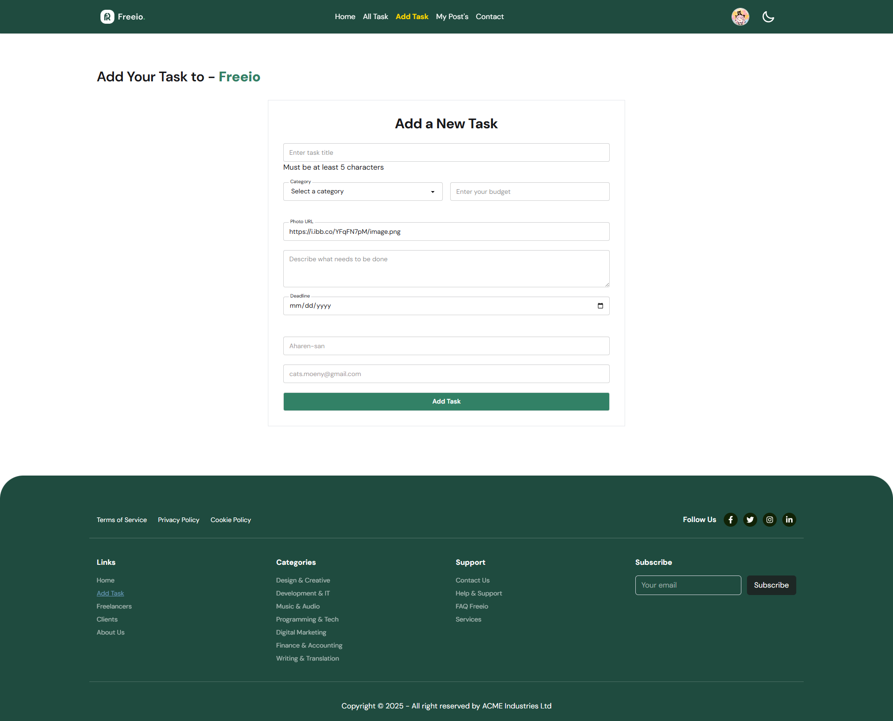
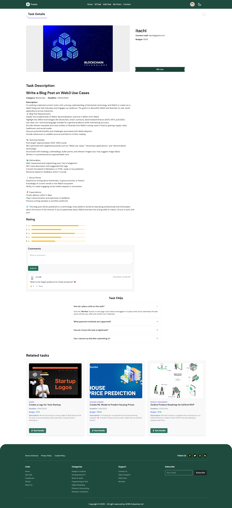
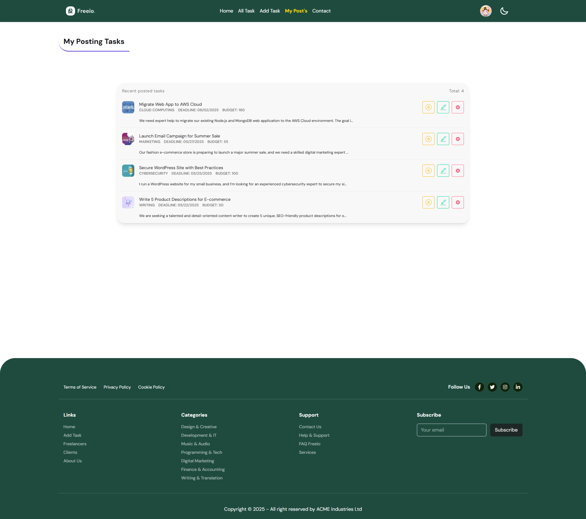
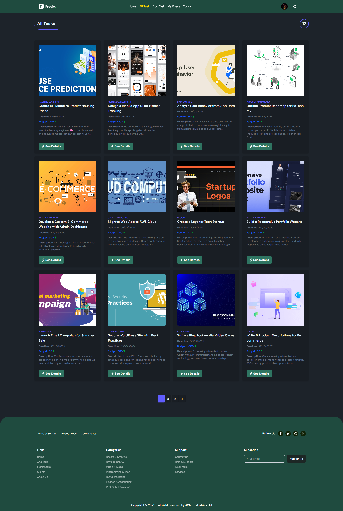
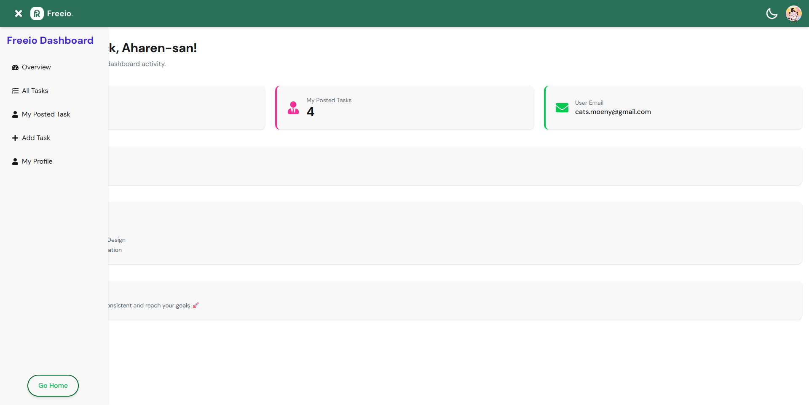
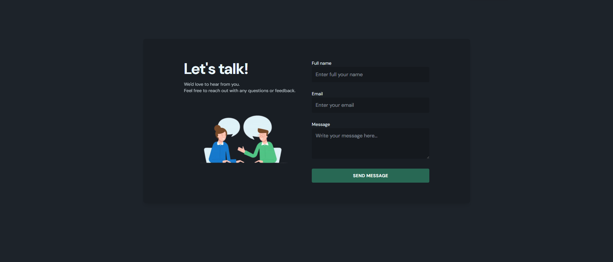

# 🧑‍💻 Free.io – Freelance Task Marketplace

Free.io is a full-stack freelance task marketplace. It allows users to post tasks, bid on freelance work, and interact through comments and task updates. The platform emphasizes real-world functionality with protected routes, authentication, responsive UI, and a smooth user experience.

## 🔗 Live Site & Repositories

- 🌐 Live Website: [Free.io](https://freeio-app.netlify.app/)
- 📁 Client GitHub: [Client](https://github.com/Programming-Hero-Web-Course4/b11a10-client-side-abuhanifsagor)
- 📁 Server GitHub: [Server](https://github.com/Programming-Hero-Web-Course4/b11a10-server-side-abuhanifsagor)

---

## 🚀 Features

- 🔐 **User Authentication** using Firebase (Email/Password, Google Login)
- ✅ **Protected Routes** with access control
- 📝 **Add, View, Update, Delete Tasks** (CRUD)
- 🗃️ **Task Bidding System** with `bidsCount` tracking
- 💬 **Comment System** with like functionality
- 🎯 **Featured Tasks Section** on homepage
- 🌙 **Dark/Light Mode Toggle**
- 📅 **Deadline-based Task Sorting**
- 📊 Dashboard Overview with total tasks, my tasks, and user data
- 📱 Fully Responsive for Mobile, Tablet & Desktop
- 🧠 Used meaningful content — no Lorem Ipsum

## 🖼️ Design Preview

| Page            | Screenshot                                                                                                                                                                           | Description                                       |
| --------------- | ------------------------------------------------------------------------------------------------------------------------------------------------------------------------------------ | ------------------------------------------------- |
| Home            | <div style="width:500px;height:300px;overflow:hidden;"></div>            | Banner slider, featured tasks, and extra sections |
| Login           | <div style="width:500px;height:300px;overflow:hidden;"></div>          | Login via email/password or Google                |
| Signup          | <div style="width:500px;height:300px;overflow:hidden;"></div>        | Register with validations and Google OAuth        |
| Add Task        | <div style="width:500px;height:300px;overflow:hidden;"></div>         | Post a new task with all necessary fields         |
| Task Details    | <div style="width:500px;height:300px;overflow:hidden;"></div> | Full task view with bidding capability            |
| My Posted Tasks | <div style="width:500px;height:300px;overflow:hidden;"></div>     | User's own tasks with edit/delete/bid options     |
| Browse Tasks    | <div style="width:500px;height:300px;overflow:hidden;"></div>  | All task listings in card/table view              |
| Dashboard       | <div style="width:500px;height:300px;overflow:hidden;"></div>    | Contact page                                      |
| Contact         | <div style="width:500px;height:300px;overflow:hidden;"></div>      | Contact page                                      |

---

## 📌 Routing & Page Structure

| Route                       | Description                                              |
| --------------------------- | -------------------------------------------------------- |
| `/` or `/home`              | Homepage with banner, featured tasks, and extra sections |
| `/add-task`                 | Add Task form (Protected)                                |
| `/all-tasks`                | Browse all tasks (card/table view)                       |
| `/tasks/:taskId`            | Task details with bid option (Protected)                 |
| `/auth/login`               | Login via email/password or Google (Public)              |
| `/auth/signup`              | Register new user (Public)                               |
| `/auth/forget-password`     | Password reset form                                      |
| `/my-profile`               | View and edit your profile (Protected)                   |
| `/about`                    | About the platform                                       |
| `/contact`                  | Contact page                                             |
| `/terms-conditions`         | Terms & Conditions                                       |
| `/cookies`                  | Cookie Policy                                            |
| `/privacy`                  | Privacy Policy                                           |
| `/dashboard`                | Dashboard main overview (Protected)                      |
| `/dashboard/all-tasks`      | Browse all tasks inside dashboard (Protected)            |
| `/dashboard/my-posted-task` | User’s posted tasks inside dashboard (Protected)         |
| `/dashboard/add-task`       | Add Task form inside dashboard (Protected)               |
| `/dashboard/my-profile`     | User profile inside dashboard (Protected)                |
| `*` or `/404`               | Not Found page                                           |

---

### Notes

- All dashboard routes are nested under `/dashboard` and use the `DashboardLayout` component.
- Routes marked as **Protected** require authentication and are wrapped inside `<PrivateRoute>`.
- Public routes (including auth) are available under the root `/` path with the `Root` layout.
- Auth routes are grouped under `/auth`.
- Data loaders are used for fetching task data on relevant routes.
- Error handling and loading states are implemented on routes where necessary.

## ⚙️ Tech Stack

### 🧩 Frontend

- React
- Tailwind CSS
- React Router
- Firebase Auth
- Material Tailwind UI
- SweetAlert2, Toastify for feedback
- Swiper, Lottie, Typewriter for animations

### 🗂 Backend

- Node.js + Express
- MongoDB with Mongoose
- Vercel for deployment

---

## 📦 Dependencies

```json
"
@lottiefiles/dotlottie-react,
@material-tailwind/react,
react-simple-typewriter,
react-fast-marquee,
react-helmet, react-countup,
date-fns,
sweetalert2,
react-toastify,
swiper,
react-icons"
```

---

## 🛠️ Installation & Setup

1. Clone the repositories
2. Install dependencies using `$npm install`
3. Setup `.env` for both client and server
4. Run development server: `npm run dev` for client, `node index.js` for server

---

## 🚀 Deployment

1. Deploy client to Netlify
2. Deploy server to Vercel

---

## 📱 Responsive Design

- Fully mobile/tablet/desktop compatible
- Theme switcher: Light and Dark

---

## 👨‍💻 Developer Info

- 🧑 Author: Abu Hanif Sagor
- 🌐 Portfolio: [abuhanifsagor](https://github.com/abuhanifsagor)
- 📧 Email: [abuhanifsagor72@gmail.com](mailto:abuhanifsagor72@gmail.com)

---

> ✨ Have a great day! Thank you for visiting! 🌟
